# Building CI/CD Pipeline for ML Project

[](https://github.com/nkraja33/Build_a_CI-CD_Pipeline/actions/workflows/python-app.yml)

In this project, we are going to depoly a web app, which is used to predict the house price using Machine Language Model.
    
   we are using the below services for this project:
   
        - Github (For version control)
        - Azure Cloud CLI ( For Infrastructure as Code)
        - Azure App Services (To depoly a webpage in cloud)
        - Azure DevOps Pipelines (To automate the depoly whenevr there is a commit in Github for source code change)

## Project Plan

   To track progress of this project, i have used the below tools, which has the clear plan to accomplish it.

   * A [Trello](<link>) board has been created to track the progress, which will help us to know the current status and Progrees of this Project.
   * I used this [spreadsheet](project-schedule.xlsx) to plan the preparation and deployment with a target date and yearly plan.

## Instructions

Below image describes the architecture of this project.
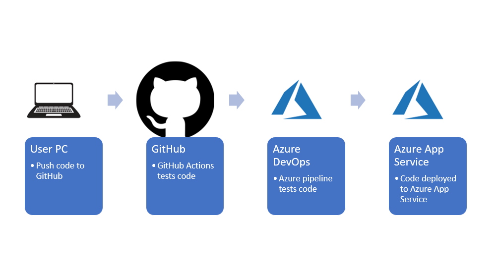

   To start with this project, you need an github and Azure account.

   Please follow the below steps to create CI/CD pipeline for ML model in Azure: For your reference i have tracked all the CLI commands in `commands.sh` file.

### 1. Prepare the environment in Azure CLI.

   a. Run the below command in Azure CLI to clone youy repository using https link. For demo purpose i have used my repositiry.
  
```
git clone https://github.com/nkraja33/Build_a_CI-CD_Pipeline.git
```

   You will get an output similar to this.
 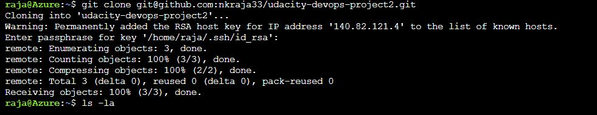 

 
 b. change to directory cloned from github

```
cd Build_a_CI-CD_Pipeline
```

 c. Create a virtual environment to make sure our app runs in a specific version of tools
 
```
make setup
```

 d. Activate the virtual environment using the below command.

```
source ~/.udacity-devops/bin/activate
```

 e. Install the Dependiencies and run the scaffolding commands.

```
make all
```

 if all dependencies were installed and if there is no syntax error in your code you will get an output similar to this.
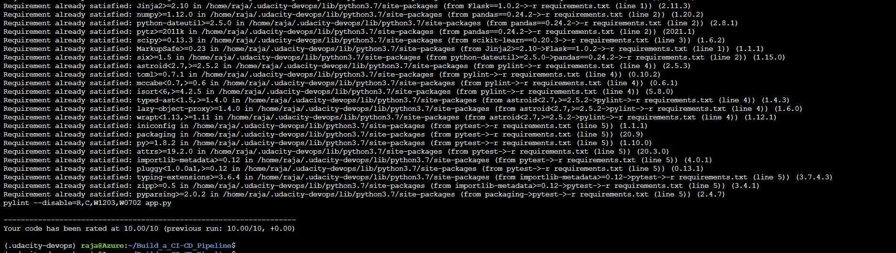 

### 2. Test application locally.

 a. Run the below command to start the applciation locally.

```
python app.py
```


b. Open a separate clous shell session


 
c. Run the below command to test the app.
```
chmod +x make_prediction.sh
./make_prediction.sh
```
you will get an output like this.


 d. swutch the original session and kill the locally running APP using `ctrl + c`
 
### 3. Depoly App in Azure App Service

 a. Create an Azure App Service.
 
 ```
 az webapp up -n ml-ci-cd
 ```
 
 
 Once done you will see an App Service is UP and running.
 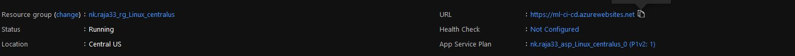
 
 And your webpage should be accessible.
 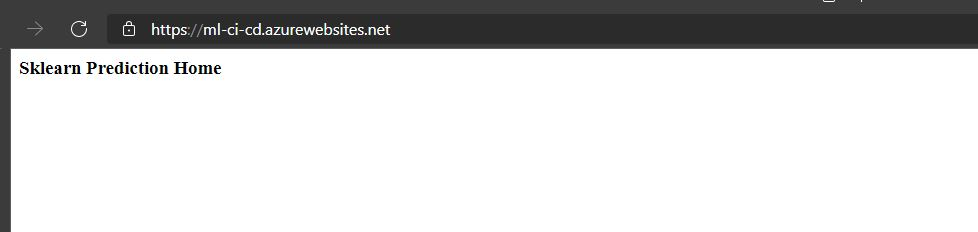
 
 #### Create a Azure Pipeline with Azure DevOps to interconnect Azure and Github
 
 b. Create a Pipeline in [Azure DevOps](https://docs.microsoft.com/en-us/azure/devops/pipelines/ecosystems/python-webapp?view=azure-devops&WT.mc_id=udacity_learn-wwl#create-an-azure-devops-project-and-connect-to-azure). Some steps in the this link will differ for our project. I have given the changes in the below steps.
 
 c. While creeating a service connection please select "<b>Python to Linux Web App on Azure</b>" in configuration wizard and select out App from drop down menu.    
 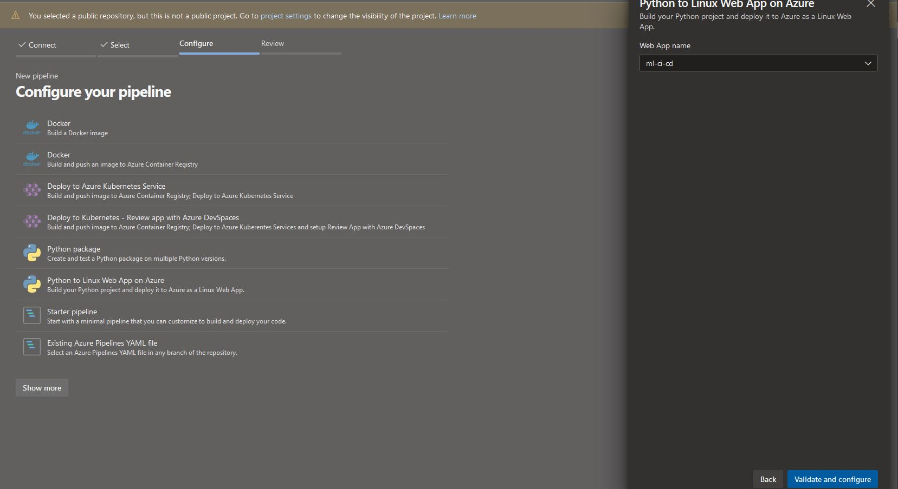
 
    once you created the service connection, it will looks like below.
  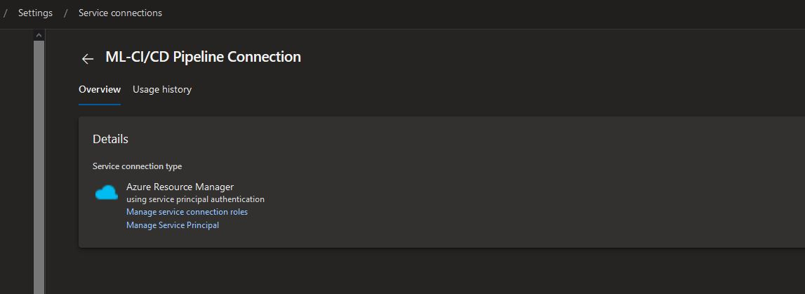
   
 d. In the last step, click save and run.
 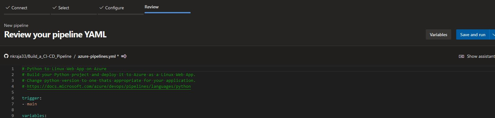
 
 it will take you to your github and make sure you want this pipeline to applied for your current repositiry and click "<b>Approve and Install</b>"
  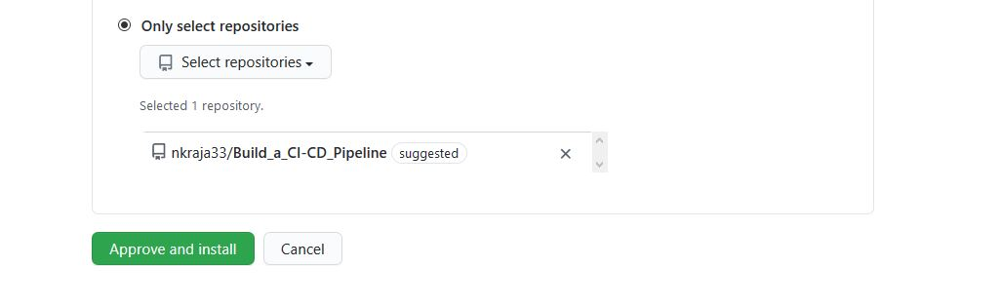
  
 e. After you install, come back to [Azure Devops portal](dev.azue.com) and check for the Jobs in Pipeline.
 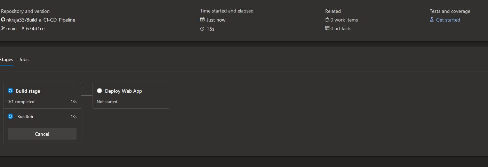
 
  it should complete without any errors like below.
 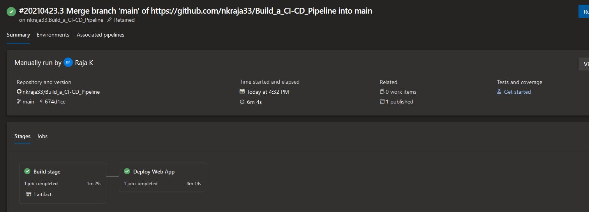

d. To check your app status and prediction.
     - open the file `make_predict_azure_app.sh` in Azure Cli and update your app name in line number 28 and make the script executable.
   ```
    chmod +x make_predict_azure_app.sh
    ./make_predict_azure_app.sh
   ```
   Here is the prediction from WebAPP.
  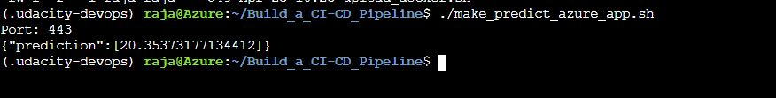
   
 
### 4. Monitor the Logs
    
  Run the below command to stream the live logs for your webapp.
 ```
  az webapp log tail -n ml-ci-cd
 ```
 
### 5. Load Test
  
  I have used locust to do  load test for our webpp. We will do a load test against the app running locally in your laptop. 

a. Run the below command to install locust:
```
pip install locust
```
b. Start the app
```
python app.py
```

c. start locust:
```
locust
```
Open this link [http://localhost:8089](http://localhost:8089). Enter the total number of users to simulate, spawn rate, set the host to localhost:5000, and click Start Swarming:


You can then watch the load test:


 

## Enhancements

 For testing, Now we have added only main web page, we will work on the schedule and we will create the additional pages and we add more branches in the Github.

## Demo 

 I have creaeted a video [Udacity-Build-CI-CD-Pipeline](www.youtube.com) to demonstrate this project step by step.


